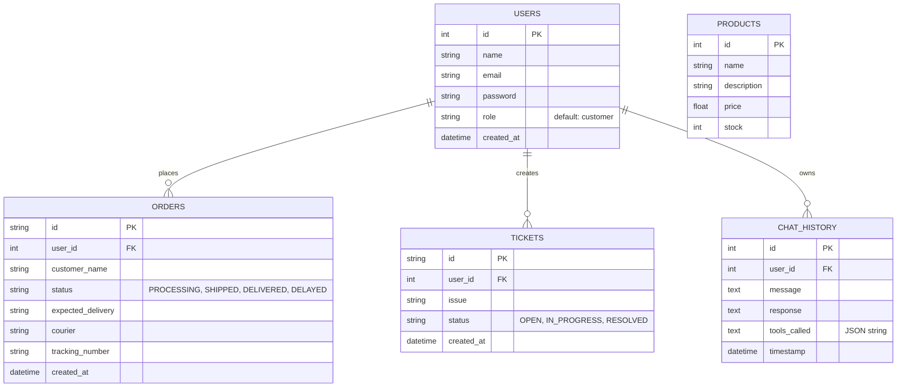

# HelpFlow AI — Enterprise AI Customer Support Platform

**HelpFlow AI** is an enterprise-grade autonomous customer engineering and support platform. It automates customer interactions using multi-step reasoning (**ReAct state machine**), **Retrieval-Augmented Generation (RAG)** with local semantic search (**FAISS**), conversation memory, and autonomous backend tool execution.

---

## 🏗 System Architecture & Features

1. **ReAct Agentic Engine**: Uses `Google Gemini` (`gemini-flash-latest`) to dynamically reason through customer inquiries, deciding whether to check real-time database records via tools or consult policy manuals via RAG.
2. **Local RAG Pipeline**: Ingests Markdown policy documents using `RecursiveCharacterTextSplitter`, `sentence-transformers/all-MiniLM-L6-v2`, and `FAISS` for sub-100ms semantic similarity search without API latency or cost.
3. **Autonomous Tool Execution**:
   - `CheckOrderTool`: Checks live order status and estimated delivery dates.
   - `CreateTicketTool`: Opens support tickets directly into the SQLite database.
   - `ProductSearchTool`: Searches product catalog by keyword and stock availability.
   - `BookAppointmentTool`: Schedules support consultations with confirmation IDs.
4. **Conversation & Entity Memory**: Sliding window context retention across multi-turn sessions with automatic extraction of user entities (`customer_name`, `last_ticket_id`, `active_order_id`).
5. **Modern SaaS UI**: Responsive cyber-brutalist / glassmorphic interface with Plus Jakarta Sans & Inter typography, Markdown rendering, optional technical inspection logs, animated progress indicators, and a dedicated **Support Manager Dashboard**.

---

## 🗄️ Entity-Relationship (ER) Diagram

The system uses a relational database (SQLite via SQLAlchemy) to track users, their interactions, orders, and tickets.



---

## 📁 Project Structure

```text
helpflow-ai/
├── frontend/                  # React + Vite + Tailwind CSS SaaS Frontend
├── backend/
│   ├── app/
│   │   ├── api/               # FastAPI REST & Agent endpoints (/chat, /tickets, /orders)
│   │   ├── agent/             # ReAct Coordinator, Prompts & Memory management
│   │   ├── rag/               # Document Loader, Text Splitter & FAISS Vector Store
│   │   ├── tools/             # Pydantic-validated backend tools (CheckOrder, CreateTicket)
│   │   ├── database/          # SQLAlchemy Engine, Session Provider & Seeding Script
│   │   ├── models/            # SQLAlchemy ORM Tables (Users, Orders, Tickets, Products)
│   │   ├── schemas/           # Pydantic DTOs for strict request/response validation
│   │   └── utils/             # JWT Authentication & Structured Logging
│   └── main.py                # Application entry point & startup event hooks
├── knowledge_base/            # Source Markdown policies (FAQs, Refund, Shipping, Warranty)
├── vector_store/              # Persistent directory for local FAISS binary indices
├── requirements.txt           # Python dependencies
└── .env.example               # Environment variable configuration template
```

---

## 🚀 Quickstart Guide

### 1. Backend Setup

```bash
# 1. Create and activate a Python virtual environment
python -m venv venv
# On Windows:
venv\Scripts\activate
# On macOS/Linux:
# source venv/bin/activate

# 2. Install dependencies
pip install -r requirements.txt

# 3. Configure environment variables
copy .env.example .env
# Open .env and set your GEMINI_API_KEY=your_actual_key

# 4. Navigate to backend directory
cd backend

# 5. Initialize Database and Seed Test Data
python -m app.database.init_db

# 6. Run the FastAPI Server
python -m uvicorn app.main:app --host 0.0.0.0 --port 8000 --reload
```

### 2. Frontend Setup

```bash
# 1. Navigate to the frontend directory
cd frontend

# 2. Install Node dependencies
npm install

# 3. Start the Vite development server
npm run dev
```

The frontend will be available at `http://localhost:5173` and connected to the backend API at `http://localhost:8000`.

---

## 🔑 Sandbox & Preview Accounts

When evaluating the application in a preview environment, you can sign in using verified sandbox accounts:

| Role | Email | Password | Description |
| :--- | :--- | :--- | :--- |
| **Customer Portal** | `customer@example.com` | `password` | Has active order `#ORD1005` (Status: `DELAYED`) and `#ORD1008` (Status: `SHIPPED`). |

---

## 🤖 Agentic Capabilities

1. **Order Status Inquiry**: Ask *"Where is my order #ORD1005?"* -> Watch HelpFlow AI invoke `CheckOrderTool` and report exact delivery details.
2. **Autonomous Ticket Creation**: Ask *"My laptop arrived with a broken screen. Please open a high-priority support ticket."* -> Watch HelpFlow AI invoke `CreateTicketTool` and return ticket ID `TCK-xxx`.
3. **Policy Q&A via RAG**: Ask *"What is your refund policy if I open the box?"* -> Watch HelpFlow AI retrieve exact restocking fee criteria from `refund_policy.md`.
4. **Context Recall**: Ask *"What was the ticket number you just created for my broken laptop?"* -> Watch HelpFlow AI recall the entity from conversation memory without executing tools again.
